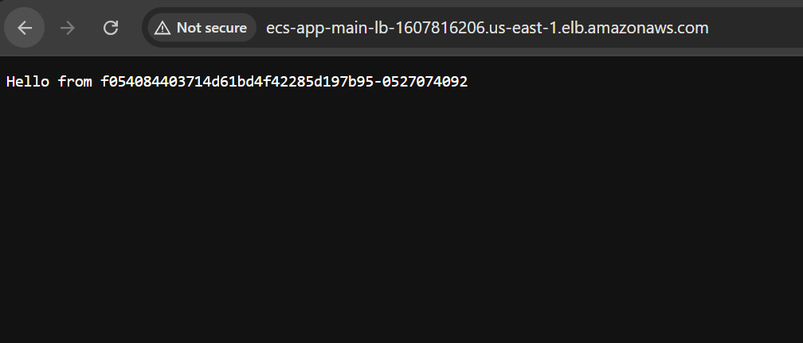

# Containerised Web App on ECS Fargate

A containerised Python web application running on AWS ECS Fargate behind an
Application Load Balancer, built entirely with Terraform. Two tasks run across two
Availability Zones with health checks, so a failed container is taken out of service
automatically and replaced.

Everything here was written from scratch rather than reused from the earlier projects
in this repository. The VPC, routing and load balancer were rebuilt deliberately
rather than pulling in the module from `03-three-tier-alb`.

## Architecture

```
                        Internet
                            |
                    Internet Gateway
                            |
                 Application Load Balancer          (public subnets, 2 AZs)
                    listener :80  ──►  target group :8080
                            |
              ┌─────────────┴─────────────┐
              |                           |
        ECS task (Fargate)          ECS task (Fargate)
          us-east-1a                  us-east-1b
          container :8080             container :8080
```

**VPC** `192.168.0.0/16`

| Subnet | CIDR | AZ | Purpose |
|---|---|---|---|
| `public_1a` | `192.168.1.0/24` | us-east-1a | ALB and tasks |
| `public_1b` | `192.168.2.0/24` | us-east-1b | ALB and tasks |
| `private_1a` | `192.168.11.0/24` | us-east-1a | reserved, unused |
| `private_1b` | `192.168.12.0/24` | us-east-1b | reserved, unused |

19 resources in total: VPC, four subnets, internet gateway, route table and
associations, two security groups, load balancer, target group, listener, IAM role
and policy attachment, ECS cluster, task definition and service.

## How a request flows

1. A request arrives at the load balancer's DNS name on **port 80**.
2. The ALB's security group allows port 80 from anywhere, so it is admitted.
3. The listener forwards it to the target group.
4. The target group picks a task that is currently **healthy**.
5. The ALB connects to that task on **port 8080**.
6. The task's security group allows port 8080 **only from the ALB's security
   group**, so the connection is admitted.
7. The container serves the response.

The port changes at the load balancer: the public side is 80, the container side is
8080. Two hops, two numbers.

## Design decisions

### Tasks run in public subnets, not private

Fargate tasks must reach ECR to pull their image and CloudWatch to write logs.
Private subnets have no route out, so reaching those services requires either a
**NAT gateway (~$32/month per AZ)** or a set of **VPC endpoints (~$28/month)**.

For a project that is built, demonstrated and destroyed in the same session, neither
cost is justified. Tasks therefore run in the public subnets with
`assign_public_ip = true`.

**Inbound access is still blocked.** The task security group accepts port 8080 only
from the ALB's security group, so nothing on the internet can reach a container
directly despite the public IP.

In production I would use private subnets with VPC endpoints, which avoids both the
NAT cost and the public IPs.

### The task security group allows the ALB's security group, not a CIDR range

An ALB is not a single machine. AWS runs nodes in each Availability Zone and
replaces them as needed, so its private IP addresses change without notice. A CIDR
rule would be a guess, and would eventually break.

Naming the ALB's security group as the source is stable regardless of which node
serves the traffic, and it is the reason nothing can reach the containers except
through the load balancer.

### `target_type = "ip"`

Fargate gives each task its own network interface and private IP inside the VPC
(`network_mode = "awsvpc"`). There is no EC2 instance to register, so the target
group holds IP addresses rather than instance IDs.

Leaving this at the default `"instance"` is the most common failure when setting up
ECS on Fargate — tasks start, nothing registers, and the load balancer returns 503.

### Health checks

The target group checks `/` every 30 seconds, requiring two consecutive successes to
mark a task healthy and two consecutive failures to take it out of service.

Requiring two rather than one avoids reacting to a single dropped request, while
still removing a genuinely dead task within about a minute.

### Two Availability Zones

An ALB requires subnets in at least two AZs and will not create otherwise. The
service runs two tasks, one per AZ, so the loss of an entire Availability Zone
leaves the application serving.

### The execution role has exactly two permissions

`AmazonECSTaskExecutionRolePolicy` grants only what ECS needs before the application
starts: pulling the image from ECR and writing logs to CloudWatch. The role cannot
read S3, start instances, or delete anything.

The application itself uses no AWS services, so no separate task role was created.

## Verification

Applied, confirmed working, and destroyed in the same session.

- Both tasks reached `healthy` in the target group, one in each AZ
- The load balancer's DNS name served the application over HTTP
- Refreshing returned different task IDs, confirming traffic was being distributed
- `terraform destroy` removed all 19 resources; the account was then confirmed empty
  via `aws elbv2 describe-load-balancers`, `aws ecs list-clusters` and
  `aws ec2 describe-instances`

Total cost for the demonstration: approximately 8 pence.



The hostname in the response is the ECS task ID. Refreshing returns a different one,
which is the load balancer distributing requests between the two tasks.

## Running it

Requires an image in ECR. The application and its Dockerfile are in
[`../04-containerised-app`](../04-containerised-app).

```bash
terraform init
terraform plan
terraform apply
```

The load balancer's DNS name can be found with:

```bash
aws elbv2 describe-load-balancers \
  --query 'LoadBalancers[?LoadBalancerName==`ecs-app-main-lb`].DNSName' \
  --output text
```

Tasks take one to two minutes to start and pass their first health checks. A `503`
before then is expected.

```bash
terraform destroy
```

**The load balancer costs roughly $16/month if left running.** Destroy it when you
are finished.

## Security scanning

The CI pipeline runs [tfsec](https://github.com/aquasecurity/tfsec) on every push,
before it authenticates to AWS, since the scanner only reads Terraform files.

Some findings were fixed. Others are deliberate, and are recorded here rather than
silently ignored — an accepted risk with a reason is not the same as one that was
missed.

**Fixed**

- Every security group rule now carries a `description`, so the intent is readable
  without tracing the references.
- `drop_invalid_header_fields = true` on the load balancer, so malformed headers are
  rejected rather than passed through to the tasks.

**Accepted, with reasons**

| Finding | Why it stands |
|---|---|
| Ingress from `0.0.0.0/0` on port 80 | This is a public website. The load balancer has to accept traffic from anyone; restricting it would defeat the purpose. The tasks behind it are not open — their security group only accepts the ALB's. |
| HTTP rather than HTTPS | Requires a domain name and an ACM certificate. Deferred; noted below as a limitation. |
| No VPC flow logs | Useful in production for investigating traffic. They cost money to store, and this stack is destroyed the same day it is built. |
| No ALB access logs | Same reasoning — needs an S3 bucket and ongoing storage. |
| Unrestricted egress | Tasks must reach ECR and CloudWatch. Restricting egress to those specific endpoints would be tighter and is what I would do in production. |

## Known limitations

- **State is local.** The other projects in this repository keep Terraform state in
  S3 with locking; this one does not yet.
- **No HTTPS.** The listener is HTTP only. Production would use an ACM certificate
  and a listener on 443, redirecting 80 to 443.
- **The image tag is `latest`.** This means "whatever was pushed most recently",
  which can change without warning. Versioned tags would be better.
- **No autoscaling.** The desired count is fixed at two.
